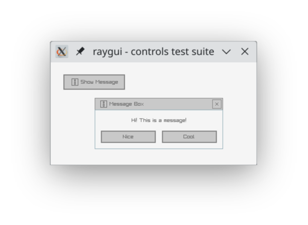

# Raylib Zig Bindings

1. One to one translation of
   [raylib.h](https://github.com/raysan5/raylib/blob/master/src/raylib.h),
   [rlgl.h](https://github.com/raysan5/raylib/blob/master/src/rlgl.h),
   [rcamera.h](https://github.com/raysan5/raylib/blob/master/src/rcamera.h) and
   [raygui.h](https://github.com/raysan5/raygui/blob/master/src/raygui.h) files in zig
2. Build tools to compile raylib from source with simple zon dependency.

- Raylib version `5.0`
- Raygui version `4.0`
- Zig version`0.13.0`

# TLDR

[Sample project here](https://github.com/L-Briand/raylib-zig-bindings-sample) using what's described below

# Setting up a project

You'll need raylib and raygui sources with the correct version:

```bash
git clone --depth 1 --branch 5.0 https://github.com/raysan5/raylib.git
git clone --depth 1 --branch 4.0 https://github.com/raysan5/raygui.git
```

Create a `build.zig.zon` file and use this project as dependency.

```zon
.{
    .name = "game",
    .version = "0.0.0",

    .dependencies = .{
        .@"raylib-zig-bindings" = .{
            .url = "https://github.com/L-Briand/raylib-zig-bindings/releases/download/1.1.0/release.tar.gz",
            .hash = "122096dfc8994542d786f21d12806a9bb9bb388d3f731aa03b0cacda0f5c48de2b5c",
        }
    },

    .paths = .{
        "",
    },
}
```

Create a `build.zig` file looking like this:

```zig
const std = @import("std");
// Import the project from zon file.
const rlzb = @import("raylib-zig-bindings");

pub fn build(b: *std.Build) !void {
    // Default zig setup
    const target = b.standardTargetOptions(.{});
    const optimize = b.standardOptimizeOption(.{});

    const exe = b.addExecutable(.{
        .name = "game",
        .root_source_file = b.path("src/main.zig"),
        .target = target,
        .optimize = optimize,
    });

    // Adding rlzb binding files for us to use in the main.zig file.
    const bindings = b.dependency("raylib-zig-bindings", .{
        .target = target,
        .optimize = optimize,
    });
    exe.root_module.addImport("rlzb", bindings.module("raylib-zig-bindings"));

    // Compiling raylib with main.zig
    // You can select which raylib C file to add in the third parameter
    var setup = try rlzb.Setup.init(b, .{ .cwd_relative = "raylib/src" }, .{});
    defer setup.deinit();

    // This line copy the raygui.h file into raylib/src to build with it.
    try setup.addRayguiToRaylibSrc(b, .{ .cwd_relative = "raygui/src/raygui.h" });

    // If you have some raylib's C #define requirements that need to be at build time. 
    // You can set them here:
    // setup.setRayguiOptions(b, exe, .{});
    // setup.setRCameraOptions(b, exe, .{});
    // setup.setRlglOptions(b, exe, .{});

    // Note: 
    // Some target needs specific opengl api version (RlglOption). 
    // For example linux .platform = DRM requires opengl_es2
    // If you do not uncomment the setup.setRlglOptions above.
    // It will add it automatically when linking.

    // Build specific for platform.
    switch (target.result.os.tag) {
        .windows => try setup.linkWindows(b, exe),
        .macos => try setup.linkMacos(b, exe),
        .linux => try setup.linkLinux(b, exe, .{ .platform = .DESKTOP, .backend = .X11 }),
        else => @panic("Unsupported os"),
    }

    // Add everything to the exe.
    setup.finalize(b, exe);

    // Default zig build run command setup
    b.installArtifact(exe);
    const run_cmd = b.addRunArtifact(exe);
    run_cmd.step.dependOn(b.getInstallStep());
    if (b.args) |args| {
        run_cmd.addArgs(args);
    }
    const run_step = b.step("run", "Run the app");
    run_step.dependOn(&run_cmd.step);
}
```

And create a `src/main.zig` file. This is the translation
of [raygui code sample](https://github.com/raysan5/raygui/tree/master?tab=readme-ov-file#code-sample).

```zig
const std = @import("std");

const rlzb = @import("rlzb");
const rl = rlzb.raylib;
const rg = rlzb.raygui;

pub fn main() !void {
   rl.InitWindow(400, 200, "raygui - controls test suite");
   defer rl.CloseWindow();
   rl.SetTargetFPS(60);

   var showMessageBox = false;

   while (!rl.WindowShouldClose()) {
      rl.BeginDrawing();
      const style = rg.GuiGetStyle(
            rg.GuiControl.DEFAULT.toCInt(),
            rg.GuiDefaultProperty.BACKGROUND_COLOR.toCInt(),
      );
      rl.ClearBackground(rl.GetColor(@bitCast(style)));

      if (rg.GuiButton(rl.Rectangle.init(24, 24, 120, 30), "#191#Show Message") > 0)
         showMessageBox = true;

      if (showMessageBox) {
         const bounds = rl.Rectangle.init(85, 70, 250, 100);
         const result = rg.GuiMessageBox(bounds, "#191#Message Box", "Hi! This is a message!", "Nice;Cool");
         if (result >= 0) showMessageBox = false;
      }

      rl.EndDrawing();
   }

   return;
}
```

Then run `zig build run`. You should see a window popping up.



If you don't want to switch between raylib and raygui. You can create a struct with wanted `usingnamespace` inside.

```zig 
const rl = struct {
    const rlzb = @import("rlzb");
    usingnamespace rlzb.raylib;
    usingnamespace rlzb.rlgl;
    usingnamespace rlzb.rcamera;
    usingnamespace rlzb.raygui;
};
```